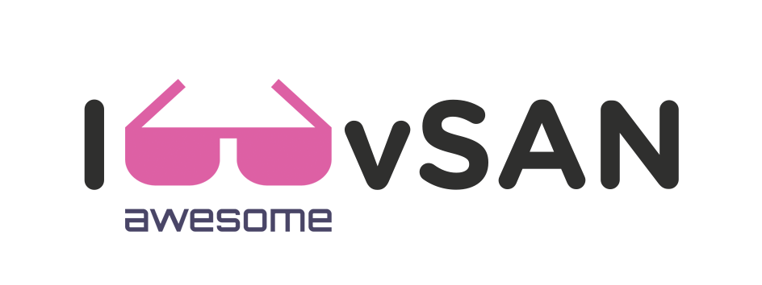

# Awesome vSAN - A Community List of AWESOME VMware vSAN Resources 
#awesomevSAN

##### _Last Update: 2019-03-21_

#### A curated list of AWESOME VMware vSAN Resources create by the community to the community.

	
	 
	 
	

---
## Contents:

- [vSAN Product info (VMware Official)](#vsan-product-info-vmware-official)
- [Documentation](#documentation)
- [Download VMware vSAN - vSAN Product Evaluation](#download)
- [vSAN Versions Release Notes](#vsan-versions-release-notes)
- [vSAN End Of Support](#vsan-end-of-support)
- [VMware Flings](#vmware-flings)
- [Tools](#tools)
- [vSAN on VMware {Code}](#vsan-on-vmware-code)
  - [SDK](#sdk)
  - [PowerCLI Cookbook](#powercli-cookbook)
  - [VMware Sample Exchange - vSAN - @ VMware {Code}](#vmware-sample-exchange---vsan----vmware-code)
- [vSAN Hands-ON Labs (HOL)](#vsan-hands-on-labs-hol)
- [Virtually Speaking Podcast Episodes (vSAN)](#virtually-speaking-podcast-episodes-vsan)
- [vSAN Blogs](#vsan-blogs)
- [vSAN Twitter List](#vsan-twitter-list)
- [vSAN Books](#vsan-books)
- [vSAN Youtube Channels / Videos](#vsan-youtube-channels--videos)
- [VMworld 2018 - vSAN Presentations & Videos](#vmworld-2018---vsan-presentations--videos)
  - [VMworld US](#vmworld-us)
  - [VMworld Europe](#vmworld-europe)
- [Misc](#misc)
- [How to contribute](#how-to-contribute)
- [Special Thanks](#special-thanks)
- [Update Log](#update-log)
- [ToDo](#todo)
  
---
### vSAN Product info (VMware Official)

_Use right click to open links in new tab/window_

- Product Page - https://www.vmware.com/products/vsan.html - English

- Product Page - https://www.vmware.com/br/products/vsan.html - Brazilian Portuguese

- Product Page - https://www.vmware.com/es/products/vsan.html - Spanish

---
### Documentation

_Use right click to open links in new tab/window_

- Official vSAN Documentation - https://docs.vmware.com/en/VMware-vSAN/index.html

- Technical references - https://storagehub.vmware.com/t/vmware-vsan/

- VMTN Community - https://communities.vmware.com/community/vmtn/vsan/overview

- vSAN Youtube Channel - https://www.youtube.com/channel/UCOQ1cSf37ags3wnn9XEOC6Q

- vSAN HCL - https://www.vmware.com/resources/compatibility/search.php?deviceCategory=vsan

- vSAN Quick Hardware Reference Guide - https://www.vmware.com/resources/compatibility/vsan_profile.html?locale=en

- vSAN Facebook Page - https://www.facebook.com/vmwarevsan

- vSAN 6.7 Licensing Guide - https://www.vmware.com/content/dam/digitalmarketing/vmware/en/pdf/products/vsan/vmware-vsan-67-licensing-guide.pdf

- Compare vSAN Editions and Features - https://www.vmware.com/products/vsan.html#compare

---
### Download

- Download VMware vSAN - vSAN Product Evaluation - https://my.vmware.com/en/web/vmware/evalcenter?p=vsan-6

---
### vSAN Versions Release Notes

_Use right click to open links in new tab/window_

- [VMware vSAN 6.7 Update 1 Release Notes](https://docs.vmware.com/en/VMware-vSphere/6.7/rn/vmware-vsan-67u1-release-notes.html)
- [VMware vSAN 6.7 Release Notes](https://docs.vmware.com/en/VMware-vSphere/6.7/rn/vmware-vsan-67-release-notes.html)
- [VMware vSAN 6.6.1 Release Notes](https://docs.vmware.com/en/VMware-vSphere/6.5/rn/vmware-vsan-661-release-notes.html)
- [VMware vSAN 6.6 Release Notes](https://docs.vmware.com/en/VMware-vSphere/6.5/rn/vmware-virtual-san-66-release-notes.html)
- [VMware Virtual SAN 6.5 Release Notes](https://docs.vmware.com/en/VMware-vSphere/6.5/rn/vmware-virtual-san-65-release-notes.html)
- [VMware Virtual SAN 6.2 Release Notes](https://docs.vmware.com/en/VMware-vSphere/6.0/rn/vmware-virtual-san-62-release-notes.html)
- [VMware Virtual SAN 6.1 Release Notes](https://docs.vmware.com/en/VMware-vSphere/6.0/rn/vmware-virtual-san-61-release-notes.html)
- [VMware Virtual SAN 6.0 Release Notes](https://docs.vmware.com/en/VMware-vSphere/6.0/rn/vmware-virtual-san-60-release-notes.html)

---
### vSAN End Of Support

_Use right click to open links in new tab/window_

|PRODUCT RELEASE|GENERAL AVAILABILITY|END OF GENERAL SUPPORT|END OF TECHNICAL GUIDANCE|
|---|---|---|---|
|vSAN 5.5|2014/03/11|2018/09/19|2020/09/19|
|vSAN 6.0, 6.1 and 6.2|2015/03/12|2020/03/12|2022/03/12|
|vSAN 6.5, 6.6 and 6.7|2016/11/15|2021/11/15|2023/11/15|

Source - https://www.vmware.com/content/dam/digitalmarketing/vmware/en/pdf/support/product-lifecycle-matrix.pdf

---
### VMware Flings - vSAN

_Use right click to open links in new tab/window_

- [vSAN Hardware Compatibility List Checker](https://labs.vmware.com/flings/vsan-hardware-compatibility-list-checker)

- [HCIBench](https://labs.vmware.com/flings/hcibench)

---
### Tools

- [vsanmetrics](https://github.com/equelin/vsanmetrics) by [Erwan Quélin @erwanquelin](https://twitter.com/erwanquelin)

	vsanmetrics is a tool written in Python for collecting usage and performance metrics and health status from a VMware vSAN cluster and translating them in InfluxDB's line protocol.
	It can be useful to send metrics in a time-serie database like InfluxDB or Graphite with the help of Telegraf and then display metrics in Grafana.

---
### vSAN on VMware {Code}

_Use right click to open links in new tab/window_

#### SDK
- vSAN Management SDK for Java - https://code.vmware.com/web/sdk/6.7U1/vsan-java
- vSAN Management SDK for .NET - https://code.vmware.com/web/sdk/6.7U1/vsan-dotnet
- vSAN Management SDK for Perl - https://code.vmware.com/web/sdk/6.7U1/vsan-perl
- vSAN Management SDK for Python - https://code.vmware.com/web/sdk/6.7U1/vsan-python
- vSAN Management SDK for Ruby - https://code.vmware.com/web/sdk/6.7U1/vsan-ruby

#### PowerCLI Cookbook
- [PowerCLI Cookbook for VMware vSAN - vv1.4](https://storagehub.vmware.com/section-assets/powercli-cookbook-for-vsan)
- [vSAN API Cookbook for Python](https://storagehub.vmware.com/t/vmware-vsan/vsan-api-cookbook-for-python/)

#### VMware Sample Exchange - vSAN - @ VMware {Code}

- [All vSAN Code](https://code.vmware.com/samples?categories=Sample&tags=vSAN&keywords=&groups=&filters=&sort=&page=)

---
### vSAN Hands-ON Labs (HOL)

_Use right click to open links in new tab/window_

- **HOL-1908-01-HCI - vSAN v6.7 - Getting Started**
vSAN delivers flash-optimized, secure shared storage with the simplicity of a VMware vSphere-native experience for all of your critical virtualized workloads.
https://labs.hol.vmware.com/HOL/catalogs/lab/4687

- **HOL-1908-02-CHG - vSAN v6.7 - Challenge Lab**
vSAN is "radically simple" to setup and get going, but how about configuring it for advanced use cases or troubleshooting performance and availability issues? You will be challenged to scale-out a vSAN cluster and to recover from misconfiguration issues.
https://labs.hol.vmware.com/HOL/catalogs/lab/4688

- **HOL-1908-91-HCI - vSAN 6.7 Lightning Lab**
Lightning Labs are an easy way to learn about VMware products in as little as 30 minutes.
https://labs.hol.vmware.com/HOL/catalogs/lab/5418

- **HOL-1945-01-SLN - Modernizing Data Centers for Business Transformation**
Modernizing your Data Center allows you to keep up with the new pace of business innovation. This lab is available in English, Português
https://labs.hol.vmware.com/HOL/catalogs/lab/4669

- **HOL-1983-02-HBD - VMware Cloud Partner Program - Tools and Offerings**
Configure VMware vCloud Director for Service Providers with VMware NSX, VMware vSAN, VMware vRealize Operations, VMware vRealize Log Insight, VMware vRealize Orchestrator, and VMware vCloud Usage Meter.
https://labs.hol.vmware.com/HOL/catalogs/lab/4671

---
### Virtually Speaking Podcast Episodes (vSAN)

_Use right click to open links in new tab/window_

- **The State of vSAN**

	http://www.vspeakingpodcast.com/episodes/107 - Mar 1, 2019 • 41 minutes

- **Free vSAN 6.7 U1 Deep Dive eBook**

	http://www.vspeakingpodcast.com/episodes/105 - Jan 28, 2019 • 1 minute

- **Elastic vSAN**

	http://www.vspeakingpodcast.com/episodes/104 - Jan 25, 2019 • 37 minutes

- **vSAN 6.7 U1 Deep Dive**

	http://www.vspeakingpodcast.com/episodes/101 - Jan 11, 2019 • 35 minutes

- **All episodes** 

	http://www.vspeakingpodcast.com/episodes?tag=vSAN

---
### vSAN Blogs

_Use right click to open links in new tab/window_

- http://www.yellow-bricks.com/
- http://www.cormachogan.com/
- http://www.virtuallyghetto.com/
- http://thenicholson.com/
- https://storagemojo.com/
- http://storagegaga.com/
- http://silvertonconsulting.com/blog/
- https://www.penguinpunk.net/blog/
- https://digitalirl.com/
- http://www.dcig.com/blog
- http://www.datacenterdude.com/
- https://d8tadude.com/
- https://www.chriscolotti.us/
- http://www.50mu.net/

---
### vSAN Twitter List

_Use right click to open links in new tab/window_

vSAN People you should follow on Twitter

**vSAN Chat**

https://twitter.com/hashtag/vsanchat?f=tweets&vertical=default&src=hash

**vSAN Who To Follow** by [Diego Flaborea](https://twitter.com/flaborea)

https://twitter.com/flaborea/lists/vsan-who-to-follow

---
**VMware vSAN**
[@vmwarevsan](https://twitter.com/vmwarevsan) - Twitter Official
VMware vSAN is a software-defined, enterprise storage solution powering industry-leading hyperconverged infrastructure systems. #vSANChat

**Captain vSAN**
[@CaptainVSAN](https://twitter.com/CaptainVSAN)
It is clobbering time... FUD Fighting, Knowledge Spreading, vSAN Super Hero!

**Duncan Epping**
[@DuncanYB](https://twitter.com/DuncanYB)
Chief Technologist Hyperconverged Infrastructure @VMware, focus on Edge and Hybrid Cloud. Author of http://Yellow-Bricks.com , vSAN and Clustering Deep dive books

**Cormac Hogan**
[@CormacJHogan](https://twitter.com/CormacJHogan)
Office of the CTO, Storage and Availability BU at VMware. Author and Blogger.

**John Nicholson**
[@Lost_Signal](https://twitter.com/Lost_Signal)
vExpert 2013-2016, Veeam Vanguard. Technical Marketing VSAN @ VMware - Storage and Availability. vSpeaking Podcast - tweets are my own

**Pete Flecha**
[@vPedroArrow](https://twitter.com/vPedroArrow)
Technical Marketing for VMware's Storage and Availability products. Host of the vSpeaking Podcast @virtspeaking vExpert 2014-2019 | Veeam Vanguard

**Yanbing Li**
[@ybhighheels](https://twitter.com/ybhighheels)
High Tech Girl in High Heels, SVP/GM Storage and Availability @VMware, Mom of 3. Determined to have a positive outlook on life.

**Josh Fidel**
[@jcefidel](https://twitter.com/jcefidel)
Global Senior Systems Engineer, #HCI, #vSAN at VMware. #VCP #EMCIE #EMCISAv2 #MCSE #CCA #CEH #vbeard #CreativeSavage. All tweets poorly formed opinion only.

**Tony Reeves**
[@importcarguy](https://twitter.com/importcarguy)
Christian, Husband, Father, Virtualization geek, VCP5-6.5DCV, 3x #vExpert & #vSANvExpert @WIVMUG Leader, Co-host of the @vGigacast, Tech Field Day delegate

**Luciano Patrão**
[@Luciano_PT](https://twitter.com/Luciano_PT)
Blogger, vExpert 4*, VCP6.5- DCV, vSAN Specialist 2*, Veeam Vanguard, TechLead Virtualization & Storage, ICT Senior Infrastructure Engineer. Backups specialist.

**Tyler Gates**
[@TSGates_](https://twitter.com/TSGates_)
SE @vmware || Co-Host @S3Vops || Passionate about HCI, data center automation, & transforming business processes || Brewer, Maker, & 3D Printer || Go Build!

**Aaron Buley**
[@aaronbuley](https://twitter.com/aaronbuley)
Global Director, @VMware HCI Engineering @DellEMC for @VxRail (#VxSEALs) | #BuleyStrong Cancer Survivor | Dad⁴ | YouTuber (link below ⤵️)

**Ken Werneburg**
[@vmKen](https://twitter.com/vmKen)
Group Manager of Technical Marketing for VMware's storage and availability products.

**Pete Koehler**
[@vmpete](https://twitter.com/vmpete)
Tech Marketing | Storage & Availability BU @ VMware. All comments mine. https://www.linkedin.com/in/pekoehler 

**Dave Morera  🦈**
[@GreatWhiteTec](https://twitter.com/GreatWhiteTec)
Solutions Architect (SABU) @VMware - #vExpert, CrossFit, Sharks, ⚽️ . Opinions = all mine

**Darin Zook**
[@darinzook](https://twitter.com/darinzook)
Christian | Husband | Father | Sr. SE vSAN/HCI @VMware - Tweets are my own. #vExpert

**Jeff Hunter (vmware)**
[@jhuntervmware](https://twitter.com/jhuntervmware)
#VMware Group Manager, #vSAN Technical Marketing. Christ follower. Husband. Dad. Jeep owner. Tweets are mine, not the official position of my employer.

**Myles Gray**
[@mylesagray](https://twitter.com/mylesagray)
Sr. Technical Marketing Architect @VMware. Writes https://blah.cloud . All things networking and storage.

**Jason Massae**
[@jbmassae](https://twitter.com/jbmassae)
@VMware, vSAN vExpert, vExpert, Christian, Family man, Scout Leader, Maker. All-Flash vSAN Pioneer, Tweets are mine

**Lee Caswell**
[@leecaswell](https://twitter.com/leecaswell)
Storage enthusiast, VMware Exec, classical trumpeter, table tennis threat, all tweets my own

**Jase McCarty**
[@jasemccarty](https://twitter.com/jasemccarty) 
TM @VMware. HCI/storage/code. Engineer/Architect & @usairforce MSgt (Ret)- Cyber Systems/ Maintainer - Christian/Husband/Dad/@Jeep-er. Life is a Big Yellow Taxi

**Paul Braren**
[@paulbraren](https://twitter.com/paulbraren) 
Dad. VMware Sr. Systems Engineer, vSAN/HCI. vExpert. All views my own. Founded TinkerTry IT @ home: efficient virtualization, storage, backup, & more...

**Myles Gray**
[@mylesagray](https://twitter.com/mylesagray)
Sr. Technical Marketing Architect @VMware. Writes https://blah.cloud . All things networking and storage.

**Glenn Sizemore**
[@glnsize](https://twitter.com/glnsize)
Technical Marketing for VMware's Storage and Availability products. All things Storage in VMware Cloud on AWS. tweets are my own.

**Ron Scott-Adams**
[@Tohuw](https://twitter.com/Tohuw)
Christian. Sr. Product Marketing Manager, Storage & Availability @VMware. @vExpert. Devout optimistic curmudgeon. Views are mine alone.

**Luigi Danakos**
[@NerdBlurt](https://twitter.com/NerdBlurt)
I have a lot of interests but mainly Tech, Video games and stuff to do w/my Family. #vExpert Work doing Social Media Marketing & Host of TechStandup Podcast

**Erwan Quélin**
[@erwanquelin](https://twitter.com/erwanquelin)
Build stuff and then fix issues... @OVH #VMware #vExpert #Dev #Automation

---
### vSAN Books

_Use right click to open links in new tab/window_

-  [vSAN 6.7U1 Deep Dive book](https://amzn.to/2QR1Gyq) 
-  [Essential VSAN](http://www.amazon.com/Essential-Virtual-SAN-VSAN-Administrators/dp/0134511662/ref=as_sl_pc_tf_til?tag=httpcormachco-20&linkCode=w00&linkId=N4CVSMZD6YJDWVHO&creativeASIN=0134511662) 

---
### vSAN Youtube Channels / Videos

_Use right click to open links in new tab/window_

- [VMware vSAN Youtube Channel](https://www.youtube.com/channel/UCOQ1cSf37ags3wnn9XEOC6Q/featured)
- [Introduction to VMware vSAN](https://www.youtube.com/watch?v=g8S3UT_vvUo)
- [VMworld 2017 - vSAN Playlist](https://www.youtube.com/playlist?list=PLHYKlysU7mcUyxDIMUZcnZqoS0YIWQ-YD) by [@duncanyb](https://twitter.com/duncanyb)
- [Introdução VMware vSAN - PT-BR](https://www.youtube.com/watch?v=0fbc_LthTrY&list=PLAh5KLOvimbhcmYdXQz41TMSPTo_AK9Dx) by [John Costa](https://twitter.com/johncostaaraujo)
- [Tech Stand Up Episode 20 – Getting Started with VMware vSAN for Free](https://nerdblurt.com/tech-stand-up-episode-20-getting-started-with-vmware-vsan-for-free/) by [Luigi Danakos @nerdBlurt](https://twitter.com/NerdBlurt)

---
### VMworld 2018 - vSAN Presentations & Videos

#### VMworld US

_Use right click to open links in new tab/window_

[Source](https://github.com/lamw/vmworld2018-session-urls/blob/master/vmworld-us-playback-urls.md) by [@lamw](https://twitter.com/lamw)

Session | Title | Stream | Download | PDF
---|---|---|---|---
|HCI1338BU | vSAN: An Ideal Storage Platform for Kubernetes-controlled Cloud-Native Apps | [STREAM](https://videos.vmworld.com/global/2018/videoplayer/23186) | [DOWNLOAD](https://s3-us-west-1.amazonaws.com/vmworld-usa-2018/HCI1338BU.mp4) | [PDF](https://cms.vmworldonline.com/event_data/10/session_notes/HCI1338BU.pdf)|
|HCI1145BU | Why VMware vSAN Is the Best Solution for Cloud Provider Environments | [STREAM](https://videos.vmworld.com/global/2018/videoplayer/23325) | [DOWNLOAD](https://s3-us-west-1.amazonaws.com/vmworld-usa-2018/HCI1145BU.mp4) | [PDF](https://cms.vmworldonline.com/event_data/10/session_notes/HCI1145BU.pdf)|
|HCI1998BU | Enable High-Capacity Workloads with Elastic EBS-Backed vSAN on VMware Cloud | [STREAM](https://videos.vmworld.com/global/2018/videoplayer/20015) | [DOWNLOAD](https://s3-us-west-1.amazonaws.com/vmworld-usa-2018/HCI1998BU.mp4) | [PDF](https://cms.vmworldonline.com/event_data/10/session_notes/HCI1998BU.pdf)|
|HCI1099BU | Real-World Deployment Considerations with vSAN | [STREAM](https://videos.vmworld.com/global/2018/videoplayer/23844) | [DOWNLOAD](https://s3-us-west-1.amazonaws.com/vmworld-usa-2018/HCI1099BU.mp4) | [PDF](https://cms.vmworldonline.com/event_data/10/session_notes/HCI1099BU.pdf)|
|HCI1246BU | Optimizing vSAN for Performance | [STREAM](https://videos.vmworld.com/global/2018/videoplayer/20380) | [DOWNLOAD](https://s3-us-west-1.amazonaws.com/vmworld-usa-2018/HCI1246BU.mp4) | [PDF](https://cms.vmworldonline.com/event_data/10/session_notes/HCI1246BU.pdf)|
|HCI1272BU | vSAN Data Placement and Availability | [STREAM](https://videos.vmworld.com/global/2018/videoplayer/24177) | [DOWNLOAD](https://s3-us-west-1.amazonaws.com/vmworld-usa-2018/HCI1272BU.mp4) | [PDF](https://cms.vmworldonline.com/event_data/10/session_notes/HCI1272BU.pdf)|
|HCI1330BU | Enabling Microsoft Failover Clustering with vSAN iSCSI Service | [STREAM](https://videos.vmworld.com/global/2018/videoplayer/22439) | [DOWNLOAD](https://s3-us-west-1.amazonaws.com/vmworld-usa-2018/HCI1330BU.mp4) | [PDF](https://cms.vmworldonline.com/event_data/10/session_notes/HCI1330BU.pdf)|
|HCI1468BU | Building a Business Case for HCI and VMware vSAN | NO Stream POSTED | NO DOWNLOAD POSTED | NO PDF POSTED|
|HCI1469BU | The Future of vSAN and Hyperconverged Infrastructure | [STREAM](https://videos.vmworld.com/global/2018/videoplayer/19207) | [DOWNLOAD](https://s3-us-west-1.amazonaws.com/vmworld-usa-2018/HCI1469BU.mp4) | [PDF](https://cms.vmworldonline.com/event_data/10/session_notes/HCI1469BU.pdf)|
|HCI1473BU | The vSAN I/O Path Deconstructed: A Deep Dive into the Internals of vSAN | [STREAM](https://videos.vmworld.com/global/2018/videoplayer/22898) | [DOWNLOAD](https://s3-us-west-1.amazonaws.com/vmworld-usa-2018/HCI1473BU.mp4) | [PDF](https://cms.vmworldonline.com/event_data/10/session_notes/HCI1473BU.pdf)|
|HCI1475QU | Demystifying vSAN Management for the Traditional Storage Administrator | [STREAM](https://videos.vmworld.com/global/2018/videoplayer/16941) | [DOWNLOAD](https://s3-us-west-1.amazonaws.com/vmworld-usa-2018/HCI1475QU.mp4) | [PDF](https://cms.vmworldonline.com/event_data/10/session_notes/HCI1475QU.pdf)|
|HCI1476BU | Mixed-Workload Versus Single-Purpose vSAN Clusters | [STREAM](https://videos.vmworld.com/global/2018/videoplayer/23704) | [DOWNLOAD](https://s3-us-west-1.amazonaws.com/vmworld-usa-2018/HCI1476BU.mp4) | [PDF](https://cms.vmworldonline.com/event_data/10/session_notes/HCI1476BU.pdf)|
|HCI1477BU | New Ways to Use vRealize Operations and Log Insight for vSAN Environments | [STREAM](https://videos.vmworld.com/global/2018/videoplayer/20297) | [DOWNLOAD](https://s3-us-west-1.amazonaws.com/vmworld-usa-2018/HCI1477BU.mp4) | [PDF](https://cms.vmworldonline.com/event_data/10/session_notes/HCI1477BU.pdf)|
|HCI1552BU | Deploying vSAN to 300 Stores in 2 Weeks: An Automation Story | [STREAM](https://videos.vmworld.com/global/2018/videoplayer/18547) | [DOWNLOAD](https://s3-us-west-1.amazonaws.com/vmworld-usa-2018/HCI1552BU.mp4) | [PDF](https://cms.vmworldonline.com/event_data/10/session_notes/HCI1552BU.pdf)|
|HCI1583BU | vSAN Myth Busters: Busting the Common Misconceptions About vSAN | [STREAM](https://videos.vmworld.com/global/2018/videoplayer/20874) | [DOWNLOAD](https://s3-us-west-1.amazonaws.com/vmworld-usa-2018/HCI1583BU.mp4) | [PDF](https://cms.vmworldonline.com/event_data/10/session_notes/HCI1583BU.pdf)|
|HCI1603BU | Tech Preview of vSAN Data Protection: Safeguarding VM Data on vSAN | [STREAM](https://videos.vmworld.com/global/2018/videoplayer/22882) | [DOWNLOAD](https://s3-us-west-1.amazonaws.com/vmworld-usa-2018/HCI1603BU.mp4) | [PDF](https://cms.vmworldonline.com/event_data/10/session_notes/HCI1603BU.pdf)|
|HCI1615PU | vSAN Technical Customer Panel on vSAN Experiences | [STREAM](https://videos.vmworld.com/global/2018/videoplayer/19572) | [DOWNLOAD](https://s3-us-west-1.amazonaws.com/vmworld-usa-2018/HCI1615PU.mp4) | [PDF](https://cms.vmworldonline.com/event_data/10/session_notes/HCI1615PU.pdf)|
|HCI1691BU | Architecting at the Tactical Edge with VMware vSAN and vRealize | NO Stream POSTED | NO DOWNLOAD POSTED | NO PDF POSTED|
|HCI1768BU | What's New in vSAN: Technical Deep Dive | [STREAM](https://videos.vmworld.com/global/2018/videoplayer/19684) | [DOWNLOAD](https://s3-us-west-1.amazonaws.com/vmworld-usa-2018/HCI1768BU.mp4) | [PDF](https://cms.vmworldonline.com/event_data/10/session_notes/HCI1768BU.pdf)|
|HCI1769BU | We Got You Covered: Top Operational Tips from vSAN Support Insight | [STREAM](https://videos.vmworld.com/global/2018/videoplayer/23301) | [DOWNLOAD](https://s3-us-west-1.amazonaws.com/vmworld-usa-2018/HCI1769BU.mp4) | [PDF](https://cms.vmworldonline.com/event_data/10/session_notes/HCI1769BU.pdf)|
|HCI1960BU | Why HCI Solutions Powered by vSAN Work Best for Your vSphere Environments | [STREAM](https://videos.vmworld.com/global/2018/videoplayer/21009) | [DOWNLOAD](https://s3-us-west-1.amazonaws.com/vmworld-usa-2018/HCI1960BU.mp4) | [PDF](https://cms.vmworldonline.com/event_data/10/session_notes/HCI1960BU.pdf)|
|HCI1993BU | vSAN Technical Deep Dive | [STREAM](https://videos.vmworld.com/global/2018/videoplayer/23217) | [DOWNLOAD](https://s3-us-west-1.amazonaws.com/vmworld-usa-2018/HCI1993BU.mp4) | [PDF](https://cms.vmworldonline.com/event_data/10/session_notes/HCI1993BU.pdf)|
|HCI2001BU | Best Practices for Deploying DataStax Workloads using vSAN Host Affinity | [STREAM](https://videos.vmworld.com/global/2018/videoplayer/22259) | [DOWNLOAD](https://s3-us-west-1.amazonaws.com/vmworld-usa-2018/HCI2001BU.mp4) | [PDF](https://cms.vmworldonline.com/event_data/10/session_notes/HCI2001BU.pdf)|
|HCI2019BU | Running SAP HANA on HCI Powered by vSAN | [STREAM](https://videos.vmworld.com/global/2018/videoplayer/19107) | [DOWNLOAD](https://s3-us-west-1.amazonaws.com/vmworld-usa-2018/HCI2019BU.mp4) | [PDF](https://cms.vmworldonline.com/event_data/10/session_notes/HCI2019BU.pdf)|
|HCI2032BU | Successful vSAN for Remote Offices and Branch Offices  | [STREAM](https://videos.vmworld.com/global/2018/videoplayer/20524) | [DOWNLOAD](https://s3-us-west-1.amazonaws.com/vmworld-usa-2018/HCI2032BU.mp4) | [PDF](https://cms.vmworldonline.com/event_data/10/session_notes/HCI2032BU.pdf)|
|HCI2038BU | Best Practices for Deploying Hadoop Workloads on HCI Powered by vSAN | [STREAM](https://videos.vmworld.com/global/2018/videoplayer/18360) | [DOWNLOAD](https://s3-us-west-1.amazonaws.com/vmworld-usa-2018/HCI2038BU.mp4) | [PDF](https://cms.vmworldonline.com/event_data/10/session_notes/HCI2038BU.pdf)|
|HCI2040BU | vSAN Deployment Topology and Availability Deep Dive: What You Need to Know | [STREAM](https://videos.vmworld.com/global/2018/videoplayer/23188) | [DOWNLOAD](https://s3-us-west-1.amazonaws.com/vmworld-usa-2018/HCI2040BU.mp4) | [PDF](https://cms.vmworldonline.com/event_data/10/session_notes/HCI2040BU.pdf)|
|HCI2041BU | vSAN Encryption Deep Dive | [STREAM](https://videos.vmworld.com/global/2018/videoplayer/24178) | [DOWNLOAD](https://s3-us-west-1.amazonaws.com/vmworld-usa-2018/HCI2041BU.mp4) | [PDF](https://cms.vmworldonline.com/event_data/10/session_notes/HCI2041BU.pdf)|
|HCI2061BU | Forget Click, Click, Click: Manage vSAN at Scale with PowerCLI | [STREAM](https://videos.vmworld.com/global/2018/videoplayer/22473) | [DOWNLOAD](https://s3-us-west-1.amazonaws.com/vmworld-usa-2018/HCI2061BU.mp4) | [PDF](https://cms.vmworldonline.com/event_data/10/session_notes/HCI2061BU.pdf)|
|HCI2088BU | vSAN Stretched Clusters Technical Deep Dive | [STREAM](https://videos.vmworld.com/global/2018/videoplayer/24204) | [DOWNLOAD](https://s3-us-west-1.amazonaws.com/vmworld-usa-2018/HCI2088BU.mp4) | [PDF](https://cms.vmworldonline.com/event_data/10/session_notes/HCI2088BU.pdf)|
|HCI2110BU | Top Reasons Why vSAN Is the Best Hyper-Converged Solution | [STREAM](https://videos.vmworld.com/global/2018/videoplayer/22909) | [DOWNLOAD](https://s3-us-west-1.amazonaws.com/vmworld-usa-2018/HCI2110BU.mp4) | [PDF](https://cms.vmworldonline.com/event_data/10/session_notes/HCI2110BU.pdf)|
|HCI2180BU | vSAN Support Insight: Inside Out | [STREAM](https://videos.vmworld.com/global/2018/videoplayer/24205) | [DOWNLOAD](https://s3-us-west-1.amazonaws.com/vmworld-usa-2018/HCI2180BU.mp4) | [PDF](https://cms.vmworldonline.com/event_data/10/session_notes/HCI2180BU.pdf)|
|HCI2208BU | vSAN Hardware Guidance on Performance and Configuration | [STREAM](https://videos.vmworld.com/global/2018/videoplayer/20872) | [DOWNLOAD](https://s3-us-west-1.amazonaws.com/vmworld-usa-2018/HCI2208BU.mp4) | [PDF](https://cms.vmworldonline.com/event_data/10/session_notes/HCI2208BU.pdf)|
|HCI2427BU | Managing vSAN Resiliency and Performance at Scale | [STREAM](https://videos.vmworld.com/global/2018/videoplayer/22624) | [DOWNLOAD](https://s3-us-west-1.amazonaws.com/vmworld-usa-2018/HCI2427BU.mp4) | [PDF](https://cms.vmworldonline.com/event_data/10/session_notes/HCI2427BU.pdf)|
|HCI2476BU | Tech Preview: RDMA and Next-Gen Storage Technologies for vSAN | [STREAM](https://videos.vmworld.com/global/2018/videoplayer/22883) | [DOWNLOAD](https://s3-us-west-1.amazonaws.com/vmworld-usa-2018/HCI2476BU.mp4) | [PDF](https://cms.vmworldonline.com/event_data/10/session_notes/HCI2476BU.pdf)|
|HCI2501BU | Accelerating Digital Transformation with InterSystems IRIS and vSAN | [STREAM](https://videos.vmworld.com/global/2018/videoplayer/22196) | [DOWNLOAD](https://s3-us-west-1.amazonaws.com/vmworld-usa-2018/HCI2501BU.mp4) | [PDF](https://cms.vmworldonline.com/event_data/10/session_notes/HCI2501BU.pdf)|
|HCI2513QU | Using vSAN Native Data Protection in the Real World | [STREAM](https://videos.vmworld.com/global/2018/videoplayer/17457) | [DOWNLOAD](https://s3-us-west-1.amazonaws.com/vmworld-usa-2018/HCI2513QU.mp4) | [PDF](https://cms.vmworldonline.com/event_data/10/session_notes/HCI2513QU.pdf)|
|HCI2522BU | Getting Started with vSAN Automation | [STREAM](https://videos.vmworld.com/global/2018/videoplayer/20076) | [DOWNLOAD](https://s3-us-west-1.amazonaws.com/vmworld-usa-2018/HCI2522BU.mp4) | [PDF](https://cms.vmworldonline.com/event_data/10/session_notes/HCI2522BU.pdf)|
|HCI2617BU | Best Practices for Deploying Business-Critical Oracle Workloads on vSAN HCI | NO Stream POSTED | NO DOWNLOAD POSTED | NO PDF POSTED|
|HCI2681BU | The Latest and Greatest with VMware vSAN | [STREAM](https://videos.vmworld.com/global/2018/videoplayer/20550) | [DOWNLOAD](https://s3-us-west-1.amazonaws.com/vmworld-usa-2018/HCI2681BU.mp4) | [PDF](https://cms.vmworldonline.com/event_data/10/session_notes/HCI2681BU.pdf)|
|HCI2736BU | Lessons Learned from Real-World vSAN Operations | [STREAM](https://videos.vmworld.com/global/2018/videoplayer/20217) | [DOWNLOAD](https://s3-us-west-1.amazonaws.com/vmworld-usa-2018/HCI2736BU.mp4) | [PDF](https://cms.vmworldonline.com/event_data/10/session_notes/HCI2736BU.pdf)|
|HCI2909QU | VMs on vSAN - An end to end view | [STREAM](https://videos.vmworld.com/global/2018/videoplayer/17474) | [DOWNLOAD](https://s3-us-west-1.amazonaws.com/vmworld-usa-2018/HCI2909QU.mp4) | [PDF](https://cms.vmworldonline.com/event_data/10/session_notes/HCI2909QU.pdf)|
|HCI2993BU | The Story of How Deloitte Migrated to vSAN | [STREAM](https://videos.vmworld.com/global/2018/videoplayer/20556) | [DOWNLOAD](https://s3-us-west-1.amazonaws.com/vmworld-usa-2018/HCI2993BU.mp4) | [PDF](https://cms.vmworldonline.com/event_data/10/session_notes/HCI2993BU.pdf)|
|HCI3000BU | Extreme Performance Series: How To Estimate vSAN Performance | [STREAM](https://videos.vmworld.com/global/2018/videoplayer/23562) | [DOWNLOAD](https://s3-us-west-1.amazonaws.com/vmworld-usa-2018/HCI3000BU.mp4) | [PDF](https://cms.vmworldonline.com/event_data/10/session_notes/HCI3000BU.pdf)|
|HCI3041BU | Introducing Scalable File Storage on vSAN with Native File Services | [STREAM](https://videos.vmworld.com/global/2018/videoplayer/20175) | [DOWNLOAD](https://s3-us-west-1.amazonaws.com/vmworld-usa-2018/HCI3041BU.mp4) | [PDF](https://cms.vmworldonline.com/event_data/10/session_notes/HCI3041BU.pdf)|
|HCI3104BU | vSAN Hosted POC: The Smoothest and Fastest Way to Test vSAN | [STREAM](https://videos.vmworld.com/global/2018/videoplayer/19547) | [DOWNLOAD](https://s3-us-west-1.amazonaws.com/vmworld-usa-2018/HCI3104BU.mp4) | [PDF](https://cms.vmworldonline.com/event_data/10/session_notes/HCI3104BU.pdf)|
|HCI3149BU | Conquer Your Storage Demands with vSAN and Intel Technologies | [STREAM](https://videos.vmworld.com/global/2018/videoplayer/23478) | [DOWNLOAD](https://s3-us-west-1.amazonaws.com/vmworld-usa-2018/HCI3149BU.mp4) | [PDF](https://cms.vmworldonline.com/event_data/10/session_notes/HCI3149BU.pdf)|
|HCI3291BU | vSAN: Data Placement Deep Dive | [STREAM](https://videos.vmworld.com/global/2018/videoplayer/19539) | [DOWNLOAD](https://s3-us-west-1.amazonaws.com/vmworld-usa-2018/HCI3291BU.mp4) | [PDF](https://cms.vmworldonline.com/event_data/10/session_notes/HCI3291BU.pdf)|
|HCI3452BU | Achieving a GDPR-Ready Architecture Leveraging VMware vSAN | [STREAM](https://videos.vmworld.com/global/2018/videoplayer/22201) | [DOWNLOAD](https://s3-us-west-1.amazonaws.com/vmworld-usa-2018/HCI3452BU.mp4) | [PDF](https://cms.vmworldonline.com/event_data/10/session_notes/HCI3452BU.pdf)|
|HCI3697BUS | Enhance your vSphere and vSAN implementations w/ Persistent Memory and SSDs | NO Stream POSTED | NO DOWNLOAD POSTED | NO PDF POSTED|
|HCI3819QU | Get the Edge on vSAN : Innovating Hyper-Converged Infrastructure | [STREAM](https://videos.vmworld.com/global/2018/videoplayer/17033) | [DOWNLOAD](https://s3-us-west-1.amazonaws.com/vmworld-usa-2018/HCI3819QU.mp4) | [PDF](https://cms.vmworldonline.com/event_data/10/session_notes/HCI3819QU.pdf)|
|WIN3450BU | Best Practices for Deploying Horizon on vSAN and VxRail | [STREAM](https://videos.vmworld.com/global/2018/videoplayer/22260) | [DOWNLOAD](https://s3-us-west-1.amazonaws.com/vmworld-usa-2018/WIN3450BU.mp4) | [PDF](https://cms.vmworldonline.com/event_data/10/session_notes/WIN3450BU.pdf)|

#### VMworld Europe

_Use right click to open links in new tab/window_

[Source](https://github.com/lamw/vmworld2018-session-urls/blob/master/vmworld-eu-playback-urls.md) by [@lamw](https://twitter.com/lamw)

Session | Title | Stream | Download | PDF
---|---|---|---|---
|HCI2208BE | vSAN Hardware Guidance on Performance and Configuration | [STREAM](https://videos.vmworld.com/global/2018/videoplayer/27109) | [DOWNLOAD](https://s3.us-east-2.amazonaws.com/vmworld-europe-2018/HCI2208BE.mp4) | NO PDF POSTED|
|HYP3286BE | Enabling High Capacity Workloads with Elastic EBS-backed vSAN on VMC | [STREAM](https://videos.vmworld.com/global/2018/videoplayer/26382) | [DOWNLOAD](https://s3.us-east-2.amazonaws.com/vmworld-europe-2018/HYP3286BE.mp4) | NO PDF POSTED|
|HCI1094BES | Enhance Your vSphere and vSAN implementations w/ Persistent Memory and SSDs | [STREAM](https://videos.vmworld.com/global/2018/videoplayer/26389) | [DOWNLOAD](https://s3.us-east-2.amazonaws.com/vmworld-europe-2018/HCI1094BES.mp4) | NO PDF POSTED|
|HCI1246BE | Optimizing vSAN for Performance  | [STREAM](https://videos.vmworld.com/global/2018/videoplayer/26709) | [DOWNLOAD](https://s3.us-east-2.amazonaws.com/vmworld-europe-2018/HCI1246BE.mp4) | NO PDF POSTED|
|HCI1329BES | Lessons Learned from Real-World vSAN Operations | [STREAM](https://videos.vmworld.com/global/2018/videoplayer/26585) | [DOWNLOAD](https://s3.us-east-2.amazonaws.com/vmworld-europe-2018/HCI1329BES.mp4) | NO PDF POSTED|
|HCI1338BE | vSAN: An Ideal Storage Platform for Kubernetes-controlled Cloud-Native Apps | [STREAM](https://videos.vmworld.com/global/2018/videoplayer/27095) | [DOWNLOAD](https://s3.us-east-2.amazonaws.com/vmworld-europe-2018/HCI1338BE.mp4) | NO PDF POSTED|
|HCI1364BE | Conquer Your Storage Demands with vSAN and Intel Technologies | NO Stream POSTED | NO DOWNLOAD POSTED | NO PDF POSTED|
|HCI1469BE | The Future of vSAN and Hyperconverged Infrastructure | [STREAM](https://videos.vmworld.com/global/2018/videoplayer/26854) | [DOWNLOAD](https://s3.us-east-2.amazonaws.com/vmworld-europe-2018/HCI1469BE.mp4) | NO PDF POSTED|
|HCI1477BE | New Ways to Use vRealize Operations and Log Insight for vSAN Environments | [STREAM](https://videos.vmworld.com/global/2018/videoplayer/26656) | [DOWNLOAD](https://s3.us-east-2.amazonaws.com/vmworld-europe-2018/HCI1477BE.mp4) | NO PDF POSTED|
|HCI1552BE | Deploying vSAN to 300 Stores in 2 Weeks: An Automation Story | [STREAM](https://videos.vmworld.com/global/2018/videoplayer/26347) | [DOWNLOAD](https://s3.us-east-2.amazonaws.com/vmworld-europe-2018/HCI1552BE.mp4) | NO PDF POSTED|
|HCI1583BE | vSAN Myth Busters: Busting the Common Misconceptions About vSAN | [STREAM](https://videos.vmworld.com/global/2018/videoplayer/27110) | [DOWNLOAD](https://s3.us-east-2.amazonaws.com/vmworld-europe-2018/HCI1583BE.mp4) | NO PDF POSTED|
|HCI1603BE | Native vSAN Data Protection: Safeguarding Virtual Machine Data on vSAN | [STREAM](https://videos.vmworld.com/global/2018/videoplayer/26640) | [DOWNLOAD](https://s3.us-east-2.amazonaws.com/vmworld-europe-2018/HCI1603BE.mp4) | NO PDF POSTED|
|HCI1615PE | vSAN Technical Customer Panel on vSAN Experiences | NO Stream POSTED | NO DOWNLOAD POSTED | NO PDF POSTED|
|HCI1768BE | What's New in vSAN: Technical Deep Dive | [STREAM](https://videos.vmworld.com/global/2018/videoplayer/27197) | [DOWNLOAD](https://s3.us-east-2.amazonaws.com/vmworld-europe-2018/HCI1768BE.mp4) | NO PDF POSTED|
|HCI1993BE | vSAN Technical Deep Dive | [STREAM](https://videos.vmworld.com/global/2018/videoplayer/27120) | [DOWNLOAD](https://s3.us-east-2.amazonaws.com/vmworld-europe-2018/HCI1993BE.mp4) | NO PDF POSTED|
|HCI2019BE | Running SAP HANA on HCI Powered by vSAN | [STREAM](https://videos.vmworld.com/global/2018/videoplayer/26764) | [DOWNLOAD](https://s3.us-east-2.amazonaws.com/vmworld-europe-2018/HCI2019BE.mp4) | NO PDF POSTED|
|HCI2032BE | Successful vSAN for Remote Offices and Branch Offices  | [STREAM](https://videos.vmworld.com/global/2018/videoplayer/26802) | [DOWNLOAD](https://s3.us-east-2.amazonaws.com/vmworld-europe-2018/HCI2032BE.mp4) | NO PDF POSTED|
|HCI2038BE | Best Practices for Deploying Hadoop Workloads on HCI Powered by vSAN | [STREAM](https://videos.vmworld.com/global/2018/videoplayer/26249) | [DOWNLOAD](https://s3.us-east-2.amazonaws.com/vmworld-europe-2018/HCI2038BE.mp4) | NO PDF POSTED|
|HCI2041BE | vSAN Encryption Deep Dive | [STREAM](https://videos.vmworld.com/global/2018/videoplayer/27108) | [DOWNLOAD](https://s3.us-east-2.amazonaws.com/vmworld-europe-2018/HCI2041BE.mp4) | NO PDF POSTED|
|HCI2088BE | vSAN Stretched Clusters Technical Deep Dive | [STREAM](https://videos.vmworld.com/global/2018/videoplayer/27117) | [DOWNLOAD](https://s3.us-east-2.amazonaws.com/vmworld-europe-2018/HCI2088BE.mp4) | NO PDF POSTED|
|HCI2180BE | vSAN Support Insight - Inside Out | [STREAM](https://videos.vmworld.com/global/2018/videoplayer/27118) | [DOWNLOAD](https://s3.us-east-2.amazonaws.com/vmworld-europe-2018/HCI2180BE.mp4) | NO PDF POSTED|
|HCI2513QE | Using vSAN Native Data Protection in the Real World | [STREAM](https://videos.vmworld.com/global/2018/videoplayer/26910) | [DOWNLOAD](https://s3.us-east-2.amazonaws.com/vmworld-europe-2018/HCI2513QE.mp4) | NO PDF POSTED|
|HCI2522BE | Getting Started with vSAN Automation | [STREAM](https://videos.vmworld.com/global/2018/videoplayer/26440) | [DOWNLOAD](https://s3.us-east-2.amazonaws.com/vmworld-europe-2018/HCI2522BE.mp4) | NO PDF POSTED|
|HCI2617BE | Best Practices for Deploying Business-Critical Oracle Workloads on vSAN HCI | [STREAM](https://videos.vmworld.com/global/2018/videoplayer/26248) | [DOWNLOAD](https://s3.us-east-2.amazonaws.com/vmworld-europe-2018/HCI2617BE.mp4) | NO PDF POSTED|
|HCI2681BE | The Latest and Greatest with VMware vSAN | [STREAM](https://videos.vmworld.com/global/2018/videoplayer/26855) | [DOWNLOAD](https://s3.us-east-2.amazonaws.com/vmworld-europe-2018/HCI2681BE.mp4) | NO PDF POSTED|
|HCI2909QER | VMs on vSAN - An End to End View | [STREAM](https://videos.vmworld.com/global/2018/videoplayer/26947) | [DOWNLOAD](https://s3.us-east-2.amazonaws.com/vmworld-europe-2018/HCI2909QER.mp4) | NO PDF POSTED|
|HCI2997BE | Scaling Beyond Big Data: HealthCare and Financial Data on vSAN | [STREAM](https://videos.vmworld.com/global/2018/videoplayer/26773) | [DOWNLOAD](https://s3.us-east-2.amazonaws.com/vmworld-europe-2018/HCI2997BE.mp4) | NO PDF POSTED|
|HCI3041BE | Introducing Scalable File Storage on vSAN with Native File Services | [STREAM](https://videos.vmworld.com/global/2018/videoplayer/26534) | [DOWNLOAD](https://s3.us-east-2.amazonaws.com/vmworld-europe-2018/HCI3041BE.mp4) | NO PDF POSTED|
|HCI3452BE | Achieving a GDPR-Ready Architecture Leveraging VMware vSAN | [STREAM](https://videos.vmworld.com/global/2018/videoplayer/26189) | [DOWNLOAD](https://s3.us-east-2.amazonaws.com/vmworld-europe-2018/HCI3452BE.mp4) | NO PDF POSTED|
|PRV1429BE | vSAN Stretched Clusters & Disaster Recovery simplified by Cloud Foundation | [STREAM](https://videos.vmworld.com/global/2018/videoplayer/27116) | [DOWNLOAD](https://s3.us-east-2.amazonaws.com/vmworld-europe-2018/PRV1429BE.mp4) | NO PDF POSTED|
|WIN3450BE | Best Practices for Deploying Horizon on vSAN and VxRail | [STREAM](https://videos.vmworld.com/global/2018/videoplayer/26250) | [DOWNLOAD](https://s3.us-east-2.amazonaws.com/vmworld-europe-2018/WIN3450BE.mp4) | NO PDF POSTED|

---
### Misc

_Use right click to open links in new tab/window_

- vSAN Stickers art by [@duncanyb](https://twitter.com/duncanyb) - http://www.yellow-bricks.com/stickersshirts/
---
### How to contribute

Read the [How to collaborate document](n/blob/master/CONTRIBUTE.MD)

---
### Special Thanks

Special Thanks for all the community members who helped me to come up with this first version.
Everything started with this [single tweet](https://twitter.com/homelaber/status/1103370599408324611) 

- https://twitter.com/Luciano_PT
- https://twitter.com/importcarguy
- https://twitter.com/paulbraren
- https://twitter.com/flaborea
- https://twitter.com/dustinplank
- https://twitter.com/mlydy
- https://twitter.com/mmagbee
- https://twitter.com/arielsanchezmor

#### Update Log
- 2019-03-20
   - added tools section
   - added vsanmetrics
   - added @erwanquelin
---
##### ToDo
- ~~Create the Table of Contents links~~ 2019-03-20
- Improve the community update process
- Tweet new commits
- Create a Twitter account for the project